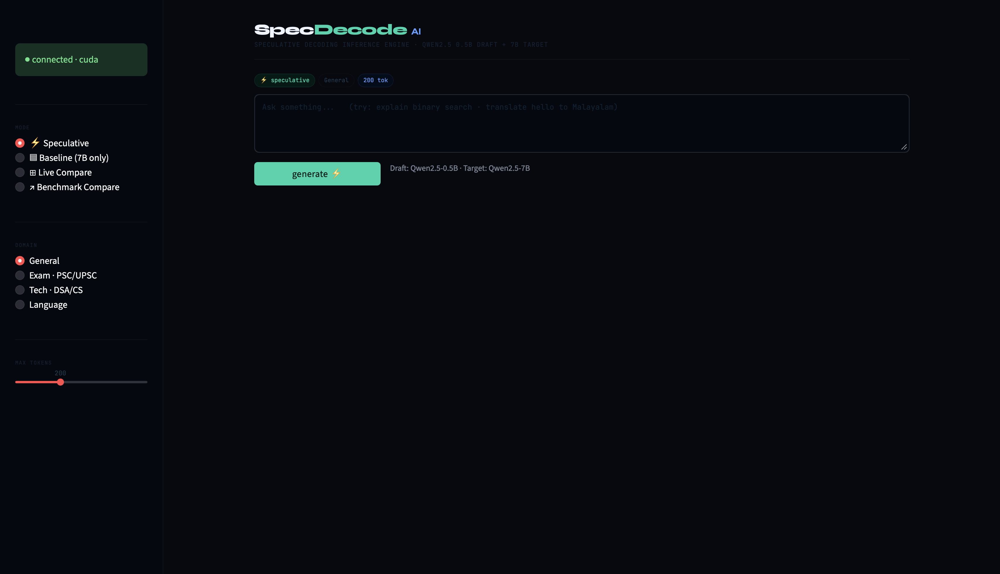
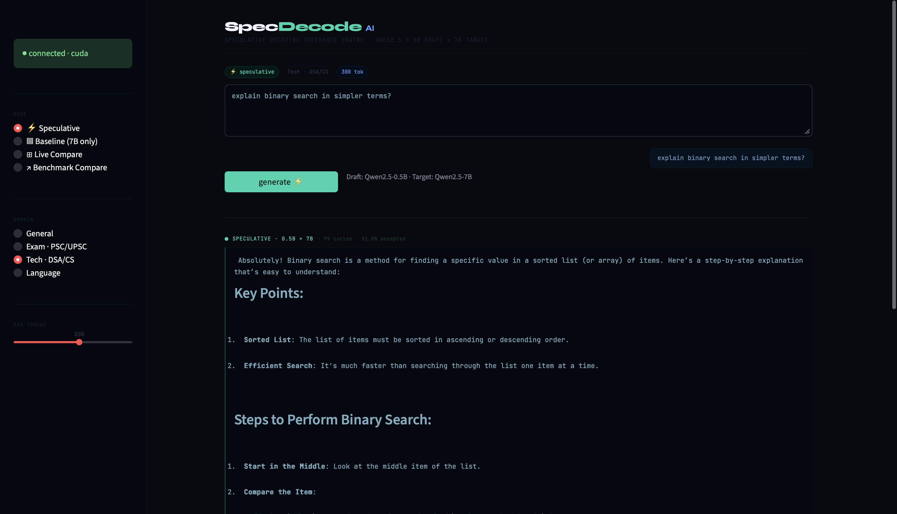
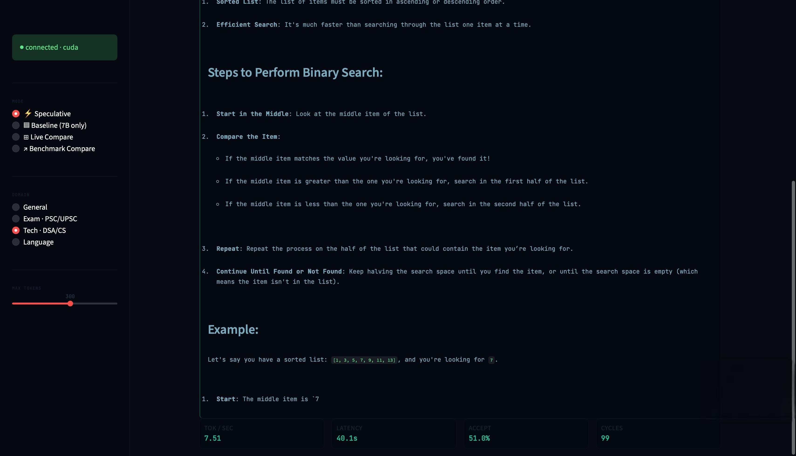

# SpecDecode AI

**Speculative Decoding Inference Engine · Qwen2.5 0.5B Draft + 7B Target**

A from-scratch implementation of speculative decoding for accelerating LLM inference on multilingual workloads (English + Malayalam). Built as an ML engineering portfolio project with a FastAPI backend, benchmarking suite, and Streamlit UI.

---

## Results

| Prompt | Speedup | Acceptance Rate | Tok/s (Speculative) | Tok/s (7B Baseline) |
|---|---|---|---|---|
| Who discovered penicillin? | 2.16x | 39.4% | 2.46 | 1.14 |
| Explain binary search | 3.40x | 76.0% | 3.88 | 1.14 |
| Stack vs queue in Malayalam | 2.25x | 41.8% | 2.57 | 1.14 |
| **Average** | **2.6x** | **52.4%** | | |

Benchmarked on a single Kaggle T4 (15GB VRAM). Key finding: running draft and target models on separate GPUs completely negates the speedup due to cross-GPU tensor transfers per speculative cycle — single GPU placement is mandatory for this architecture.

---

## Architecture

```
prompt
  └── Draft model (Qwen2.5-0.5B)
        └── generates k candidate tokens
              └── Target model (Qwen2.5-7B)
                    └── verifies in parallel
                          ├── accepted → append tokens
                          └── rejected → resample from target distribution
```

- **Draft model:** Qwen2.5-0.5B — fast token proposal
- **Target model:** Qwen2.5-7B — quality verification
- **Vocab mismatch handling:** `min_vocab` truncation in `_resample` (151,936 vs 152,064 tokens)
- **Device strategy:** both models forced to `cuda:0` — cross-device transfers kill speedup

---

## Project Structure

```
speculative-llm-engine/
├── api/
│   └── main.py              # FastAPI server · /generate, /health, /stats
├── benchmarks/
│   └── run_bench.py         # Benchmark runner
├── engine/
│   ├── draft.py             # Baseline autoregressive generation
│   └── speculative.py       # Core speculative decoding loop
├── metrics/
│   ├── logger.py            # JSON append logger
│   └── logs.json            # Benchmark results
├── models/
│   ├── config.py            # Model paths and settings
│   └── loader.py            # Device-agnostic model loading (CUDA/MLX)
├── ui/
│   └── app.py               # Streamlit UI
├── tests/
│   └── test_engine.py
└── requirements.txt
```

---

## Setup

```bash
git clone https://github.com/adithyanum/speculative-llm-engine
cd speculative-llm-engine
pip install -r requirements.txt
```

Set your backend URL in `.env`:
```
BACKEND_URL=https://your-tunnel-url
```

**Start the API (Colab/Kaggle T4):**
```python
import os
os.environ["CUDA_VISIBLE_DEVICES"] = "0"  # critical — single GPU only

import uvicorn
uvicorn.run("api.main:app", host="0.0.0.0", port=8000)
```

**Start the UI:**
```bash
streamlit run ui/app.py --server.port 8501
```

---

## API

| Endpoint | Method | Description |
|---|---|---|
| `/generate` | POST | Run speculative or baseline generation |
| `/health` | GET | Server + model status |
| `/stats` | GET | Aggregated metrics from logs |

```bash
curl -X POST https://your-url/generate \
  -H "Content-Type: application/json" \
  -d '{"prompt": "explain binary search", "mode": "speculative", "max_new_tokens": 200}'
```

---

## UI Modes

- **⚡ Speculative** — draft + target with acceptance metrics
- **▣ Baseline** — 7B only, autoregressive
- **⊞ Live Compare** — both models run simultaneously
- **↗ Benchmark Compare** — sequential runs for accurate measurement

---

## Demo

### UI


### Live Inference — Speculative Mode


> **SPECULATIVE · 0.5B + 7B** · 99 cycles · 51.0% accepted · 7.51 tok/s
> Mode: Tech · DSA/CS · 300 max tokens

### Full Response View


---

## V2 Roadmap

- [ ] Swap draft to Qwen2.5-1.5B for higher acceptance rates on non-English prompts
- [ ] FastAPI streaming + `st.write_stream` in UI
- [ ] Hybrid critic loop — confidence threshold 0.75, max 2-iteration cap
- [ ] Structured JSON output mode
- [ ] Docker + Hugging Face Spaces deployment
- [ ] Load testing at 10/50/100 concurrent users

---

## Stack

`Python` `PyTorch` `Transformers` `FastAPI` `Streamlit` `Pydantic` `MLX`

---

*Part of a series of ML engineering portfolio projects. Previous: [Neural Edge Distiller](https://github.com/adithyanum) (CoT distillation via LoRA on MLX) · RAG V3 pipeline with ReAct agent.*
